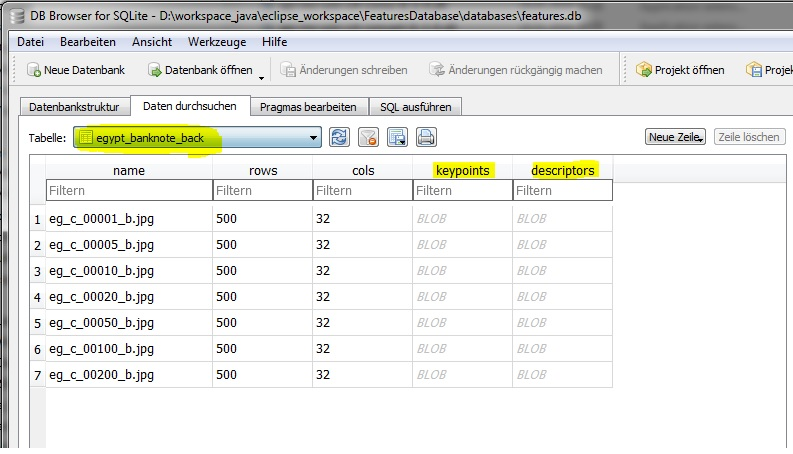

# OpenCV Features Database

This class provides a way to store Mat objects into a database for Android applications.

## Why is it needed?

In image processing applications it commonly required to read an image then calculate its features.
The features are calculated from input images and returned as keypoints and descriptors.

Suppose that you need to repeat this operation every time your Android app is initialized, then you
will waste time reading the image, calculating keypoints, then computing the descriptors.

The soltion provided here is that you detect keypoints and compute descriptors only once,
then store them in SQLite database. This is done away from the Android in a Java application, afterwardds 
the database is placed in Android under the assets folder.

This will save Android application initializtion time dramatically because you are reading from
database. It reduces also the APK size because we don't need to store the images in the assets
folder, but only the Mat objects of the keypoints and the descriptors.

## How does it look like?

When you run the application it scans all the specified folders under ./images directory.
Then keypoints are detected and descriptors are computed. Just for debugging we write the images
with the keypoints drawn, for example:


Then it will convert the keypoints and descriptor into Java byte array so that the can be insereted
as a blob to the database as shown in the following screen shot:




## How to install


Clone the source code and the eclipse project

```
git clone https://github.com/developer1-serapeum/FeatureDatabase.git
```

Download Eclipse IDE for Java Developers from

```
https://www.eclipse.org/downloads/packages/
```

Install OpenCV 3.4.1 (or above) for java as explained in:

```
https://opencv-java-tutorials.readthedocs.io/en/latest/01-installing-opencv-for-java.html
```

Add SQLite JDBC Driver JAR file to a Java project as explained here:

```
http://www.sqlitetutorial.net/sqlite-java/sqlite-jdbc-driver/
```

Download database browser for SQLite from:

```
https://sqlitebrowser.org/
```

## Related references

* http://answers.opencv.org/question/8873/best-way-to-store-a-mat-object-in-android/
* https://stackoverflow.com/questions/21849938/how-to-save-opencv-keypoint-features-to-database
